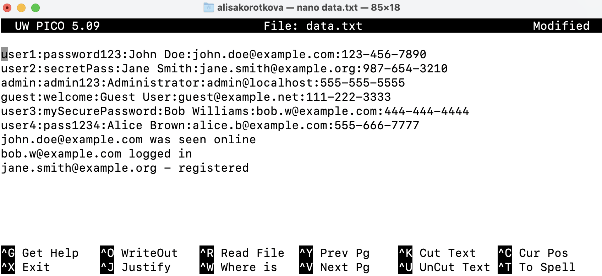
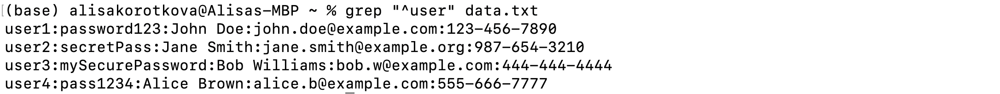
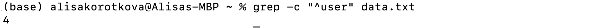
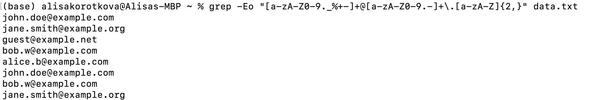
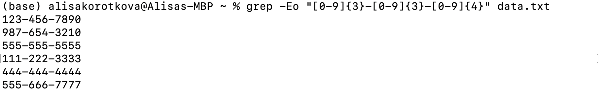
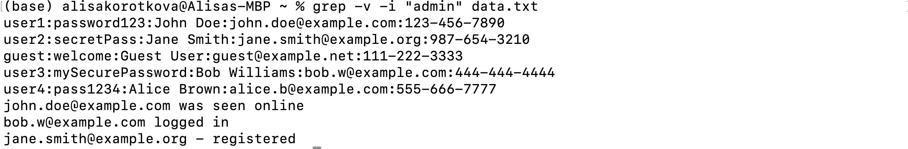
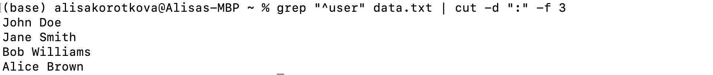

## Домашнее задание
***
<h5 align="center">Министерство науки и высшего образования Российской Федерации

ФЕДЕРАЛЬНОЕ ГОСУДАРСТВЕННОЕ АВТОНОМНОЕ ОБРАЗОВАТЕЛЬНОЕ УЧРЕЖДЕНИЕ ВЫСШЕГО ОБРАЗОВАНИЯНАЦИОНАЛЬНЫЙ ИССЛЕДОВАТЕЛЬСКИЙ УНИВЕРСИТЕТ ИТМО

ITMO University

Отчет по домашнему заданию

По дисциплине Информатика

Короткова Алиса Александровна

Факультет инфокоммуникационных технологий

Группа К3160

Направление подготовки 45.03.04 Интеллектуальные системы в гуманитарной сфере

Образовательная программа Языковые модели и искусственный интеллект</h5>
***

## Задание - Поиск с использованием опций и регулярных выражений
 
Для выполнения данного задания необходимо ознакомиться с различными доступными опциями для команды `grep` и изучить использование регулярных выражений.

1. Создала новый текстовый файл с именем `data.txt` и вставила в него следующий текст:

## Поиск пользователей:
Используя `grep "^user" data.txt`, я получила записи пользователей (т.е. начинаются с user)

`^` : Соответствует началу строки.

`""` - искомый текст.

`-c` : Выводит только количество строк, соответствующих шаблону, а не сами строки.

В итоге, получилось 4 пользователя.

## Поиск электронной почты:
Используя `grep -Eo "[a-zA-Z0-9._%+-]+@[a-zA-Z0-9.-]+\.[a-zA-Z]{2,}" data.txt` и регулярные выражения, нахожу и вывожу все электронные адреса из `data.txt`

`-Eo:` Выводит только ту часть строки, которая соответствует шаблону, а не всю строку, и использует расширенные регулярные выражения (ERE).

`[a-zA-Z0-9._%+-]` : Все строчные и прописные буквы латинского алфавита, все цифры от 0 до 9, символы точка (.), нижнее подчеркивание (_), процент (%), плюс (+) и минус (-) - все что можно вписать в название почты.

`+` : Означает, что предыдущий элемент (набор символов в квадратных скобках) должен встречаться один или более раз. Это значит, что имя пользователя должно иметь как минимум один символ.

`@` : Соответствует самому символу `@`, который разделяет имя пользователя и домен в адресе электронной почты.

`\.` : Tочка (.) является специальным символом в регулярных выражениях, который соответствует любому символу. Чтобы найти именно точку, её нужно экранировать обратным слешем `\.`.

`[a-zA-Z]` : Все строчные и прописные буквы латинского алфавита.

`{2,}` : Означает, что предыдущий элемент (набор символов в квадратных скобках) должен встречаться два или более раз.

## Поиск номеров телефонов:
Используя `grep -Eo "[0-9]{3}-[0-9]{3}-[0-9]{4}" data.txt` и регулярные выражения, найдите и выведите все номера телефонов из data.txt в формате XXX-XXX-XXXX.

`-Eo:` Выводит только ту часть строки, которая соответствует шаблону, а не всю строку, и использует расширенные регулярные выражения (ERE).

`[0-9]` : Все цифры от 0 до 9.

`{3}` : Означает, что предыдущий элемент (набор символов в квадратных скобках) должен встречаться три раза.

## Фильтрация пользователей:
Используя `grep -v -i "admin" data.txt, я вывожу все строки из data.txt, которые не содержат слово “admin” (без учета регистра).

`-v`: Выводит строки, которые не содержат заданный шаблон.

`-i`: Поиск без учета регистра (например, grep -i "text" найдет “text”, “Text”, “TEXT” и т.д.).

## Комбинирование с cut:
Используя `grep "^user" data.txt | cut -d ":" -f 3`, вывожу только имена пользователей (третье поле) из записей пользователей в data.txt.

`^` : Соответствует началу строки.

`|` : Перенаправляет вывод предыдущей команды на вход следующей команды .

`cut` : Это команда, которая извлекает определенные части строк (столбцы) на основе разделителя.

`-d : `: Это опция, которая указывает разделитель для полей.

`-f 3` : Это опция, которая указывает на номер поля, которое нужно извлечь.

## Сложный шаблон:
Используя `grep "^user.*[0-9]$" data.txt` и регулярные выражения, нахожу и вывожу все строки из data.txt, которые начинаются с “user” и заканчиваются на цифру.

`^` : Соответствует началу строки.

`.` : Соответствует любому одному символу, кроме перевода строки.

`*` : Соответствует нулю или более повторениям предыдущего символа или группы.

`[0-9]` : Все цифры от 0 до 9.

`$` : Соответствует концу строки.

